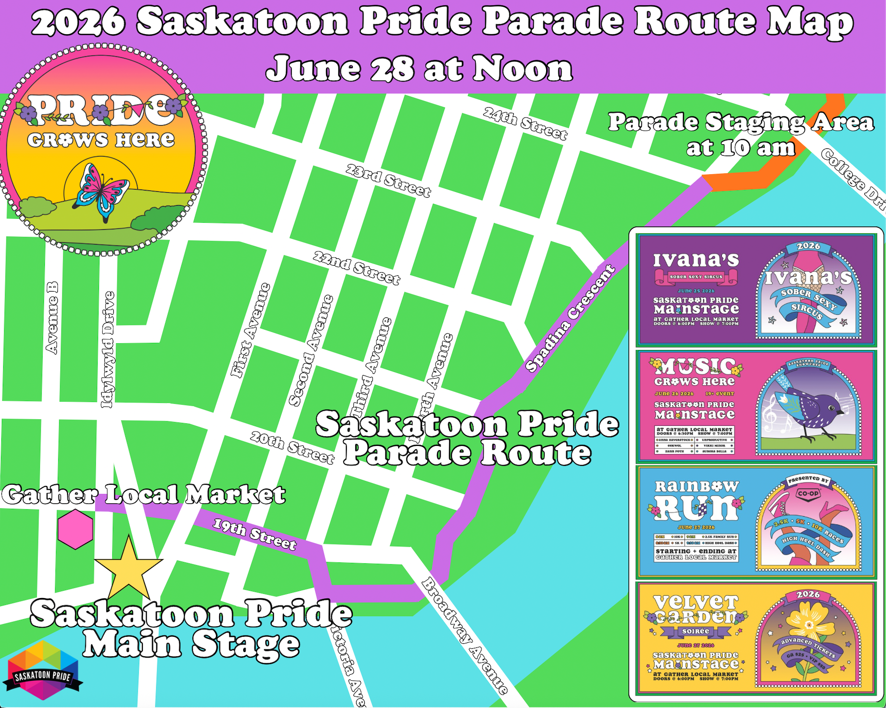

Prairie Lily Furs is in **Group 3, Slot 11** in between Light of the Prairies and Amnesty International. Please arrive around 11:00 AM and 11:45 AM, bring water and sunscreen. Parade will happen regardless of weather.

Be aware that we may have floats coming through the staging area: stay on the grass and off the road! Walking participants may enter via Spadina/24th entrance.

